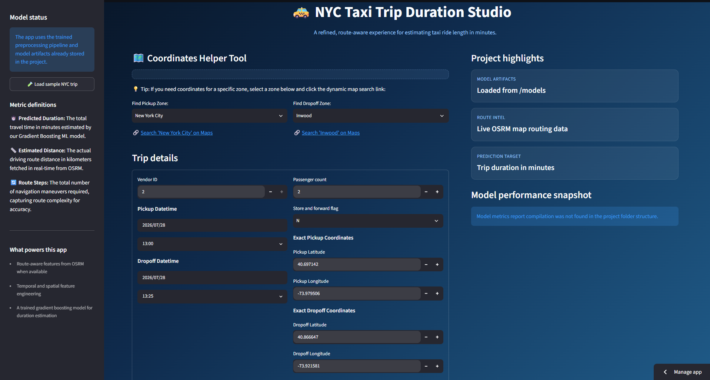
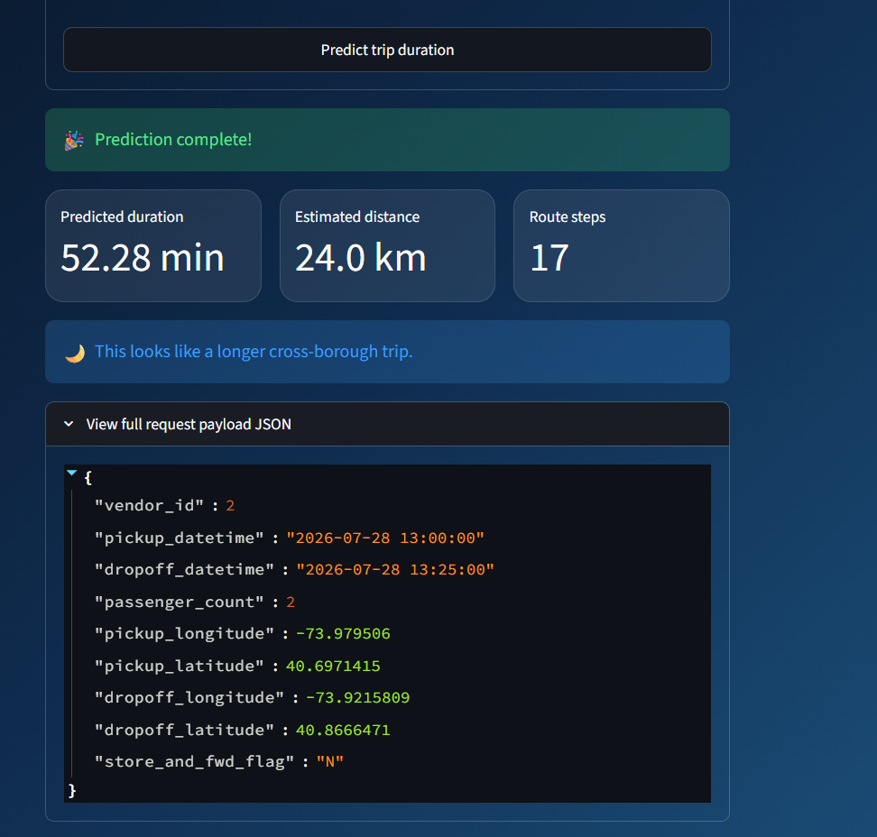
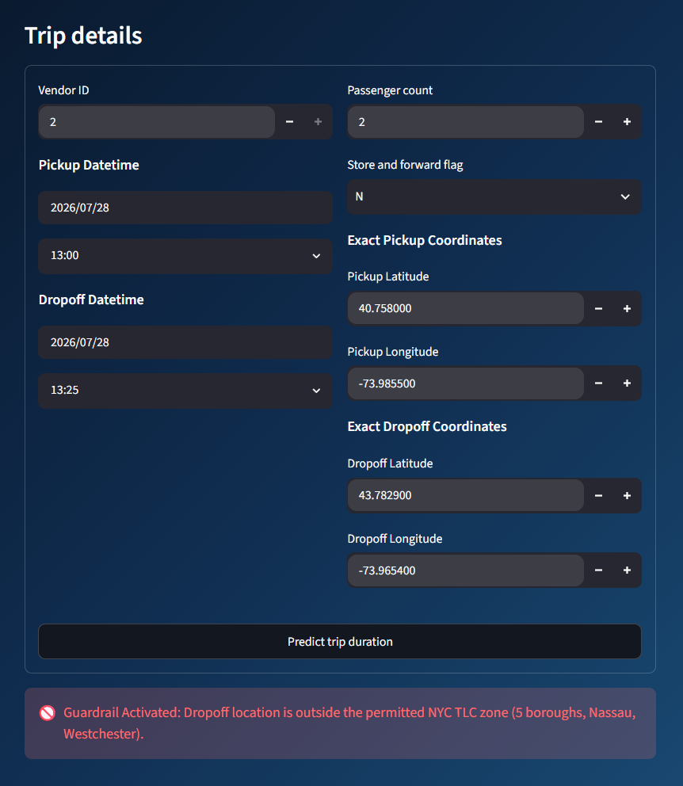
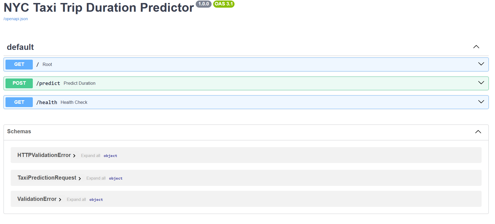
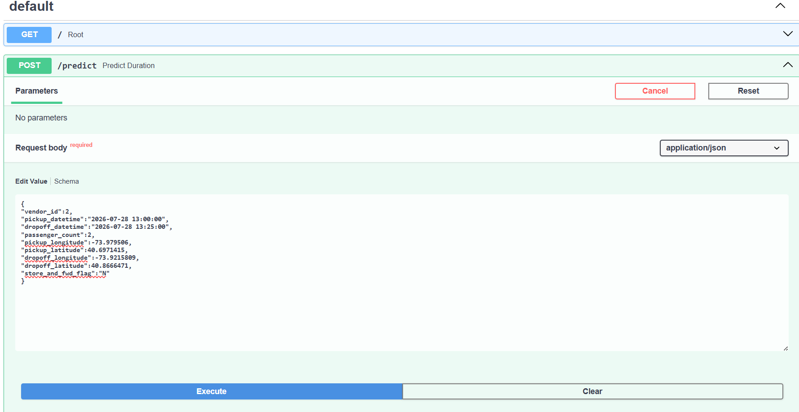
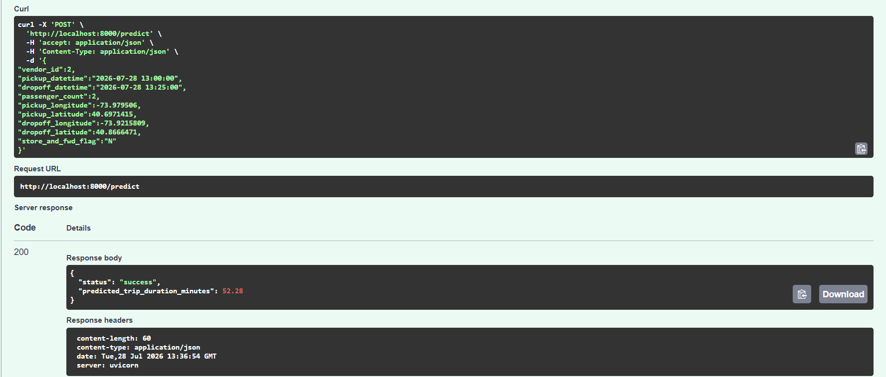

# 🚕 NYC Taxi Trip Duration Studio

[Live Demo](https://nyc-taxi-trip-duration-studio.streamlit.app/)

<p align="center">
  <a href="https://cookiecutter-data-science.drivendata.org/"></a>
  <a href="https://www.python.org/"></a>
  <a href="https://streamlit.io/"></a>
  <a href="https://dvc.org/"></a>
  <a href="https://mlflow.org/"></a>
  <a href="https://aws.amazon.com/"></a>
  <a href="https://www.docker.com/"></a>
  <a href="https://github.com/features/actions"></a>
  <a href="LICENSE"></a>
</p>

An end-to-end **MLOps** project that predicts the total trip duration of taxi rides in New York City. It features a reproducible ML pipeline orchestrated by **DVC**, experiment tracking with **MLflow on DagsHub**, a **Streamlit** web application for real-time route-aware predictions, and a fully automated **CI/CD pipeline** that builds, pushes to **AWS ECR**, and deploys to an **AWS EC2** instance via a self-hosted GitHub Actions runner.

---

## Architecture Overview 🏗️

```text
 ┌───────────┐  git push   ┌──────────────────┐   docker push   ┌───────────┐
 │  Developer├────────────►│  GitHub Actions  ├────────────────►│  AWS ECR  │
 └───────────┘             │  CI/CD Pipeline  │                 └─────┬─────┘
                           └──────────────────┘                       │
                                    │                           docker pull
                                    │ self-hosted runner              │
                                    ▼                                 ▼
                           ┌──────────────────┐              ┌──────────────┐
                           │   AWS EC2        │◄─────────────│  Docker      │
                           │   (Production)   │ run container│  Container   │
                           └────────┬─────────┘              └──────────────┘
                                    │
                              fetch artifacts
                                    │
                                    ▼
                           ┌──────────────────┐
                           │   AWS S3 Bucket  │
                           │   (Model Store)  │
                           └──────────────────┘
```

---

## Tech Stack 🛠️

| Category               | Technology                                                           |
| ----------------------- | -------------------------------------------------------------------- |
| **Language**            | Python 3.10+                                                         |
| **ML Models**           | LightGBM, XGBoost                                                   |
| **Preprocessing**       | scikit-learn, pandas, reverse-geocoder                               |
| **Route Intelligence**  | OSRM (Open Source Routing Machine)                                   |
| **Pipeline**            | DVC (Data Version Control)                                           |
| **Experiment Tracking** | MLflow (hosted on DagsHub)                                           |
| **Web App**             | Streamlit                                                            |
| **Containerization**    | Docker, Docker Compose                                               |
| **CI/CD**               | GitHub Actions (self-hosted runner on EC2)                           |
| **Cloud**               | AWS EC2 (deployment), ECR (image registry), S3 (model artifact store)|
| **Linting**             | Ruff                                                                 |

---

## Features ✨

- **Reproducible ML Pipeline** — Six-stage DVC pipeline covering data processing, OSRM-enriched feature engineering, model training, and evaluation.
- **Experiment Tracking** — All training runs, hyperparameters, and metrics are logged to MLflow on DagsHub.
- **Streamlit Web App** — Interactive UI with zone-based coordinate lookup, geographic guardrails, and live OSRM routing.
- **OSRM Route Intel** — Real-time driving distance, travel time, and step count for every prediction.
- **Automated CI/CD** — Every push to `master` triggers lint → build → push to ECR → deploy to EC2.
- **Cloud Deployment** — Production application runs on an AWS EC2 instance with model artifacts pulled from S3 at startup.
- **Kubernetes-Ready** — Includes `deployment.yaml` with health probes, resource limits, and Kubernetes secret management.

---

## Model Performance 📊

Metrics sourced from [`reports/evaluation_metrics.json`](reports/evaluation_metrics.json):

| Metric                | Train        | Test         |
| --------------------- | ------------ | ------------ |
| **MAE**               | 2.76 min     | 2.89 min     |
| **RMSE**              | —            | 4.80 min     |
| **R²**                | 0.824        | 0.806        |
| **Cross-Val MAE**     | —            | 2.90 min     |
| **Prediction Bias**   | —            | −0.54 min    |

> **Interpretation**: The model generalises well — the gap between train and test MAE is only **0.13 min**, and a near-zero prediction bias confirms minimal systematic over/under-estimation.

---

## Screenshots 📸

### Streamlit Web Application

 
 
 


### FastAPI Swagger Docs

<!-- Replace the path below with your actual screenshot -->




---

## DVC Pipeline 🔄

The ML pipeline is defined in `dvc.yaml` and managed via `params.yaml`. Below is the execution flow:

```text
  data/raw/NYC.csv
        │
        ├──► dataset_baseline ──► features_baseline
        │
        └──► dataset_osrm ──► features_osrm ──► Model_Training ──► Model_Evaluating
              (+ OSRM data)                      (LightGBM/XGB)    (metrics + predictions)
```

| Stage               | Script                        | Key Outputs                                  |
| -------------------- | ----------------------------- | -------------------------------------------- |
| `dataset_baseline`   | `src/dataset_baseline.py`     | `data/processed/baseline/processed_NYC.csv`  |
| `features_baseline`  | `src/features_baseline.py`    | Train/test feature & label splits            |
| `dataset_osrm`       | `src/dataset_osrm.py`        | `data/processed/osrm_boosted/processed_osrm_NYC.csv` |
| `features_osrm`      | `src/features_osrm.py`       | Train/test feature & label splits (OSRM)     |
| `Model_Training`     | `src/modeling/train.py`       | `models/model.joblib`                        |
| `Model_Evaluating`   | `src/modeling/predict.py`     | `reports/evaluation_metrics.json`            |

---

## Project Organization 📂

```text
├── .github/workflows/
│   └── ci-cd.yaml              ← GitHub Actions CI/CD pipeline
├── data/
│   ├── raw/                    ← Original immutable data (NYC.csv)
│   ├── external/               ← OSRM route data (osrm_data.csv)
│   └── processed/              ← Pipeline-generated train/test splits
├── models/                     ← Trained model & preprocessor (.joblib)
├── notebooks/                  ← Jupyter notebooks for exploration
├── reports/
│   ├── evaluation_metrics.json ← Model evaluation output
│   └── figures/                ← Generated charts and plots
├── src/
│   ├── config.py               ← Centralized paths, feature lists, constants
│   ├── dataset_baseline.py     ← Baseline data preprocessing
│   ├── dataset_osrm.py         ← OSRM-enriched data preprocessing
│   ├── feature_definitions.py  ← Shared feature column definitions
│   ├── features_baseline.py    ← Baseline feature engineering + split
│   ├── features_osrm.py        ← OSRM feature engineering + split
│   └── modeling/
│       ├── train.py            ← Model training (LightGBM / XGBoost)
│       └── predict.py          ← Model evaluation & metric generation
├── api/
│   ├── service.py                  ← FastAPI REST API server
│   └── schemas.py              ← Pydantic request/response models
├── app.py                      ← Streamlit web application
├── fetch_artifacts.py          ← S3 model artifact downloader (used in Docker)
├── deployment.yaml             ← Kubernetes Deployment + Service manifests
├── Dockerfile                  ← Multi-stage Docker image
├── compose.yaml                ← Docker Compose for local development
├── dvc.yaml                    ← DVC pipeline definition
├── params.yaml                 ← Hyperparameters & pipeline config
├── requirements.txt            ← Python dependencies
├── pyproject.toml              ← Project metadata & Ruff config
├── Makefile                    ← Convenience commands (env, deps, lint)
└── LICENSE                     ← MIT License
```

---

## Getting Started 🚀

### Prerequisites

| Tool                  | Required | Purpose                            |
| --------------------- | -------- | ---------------------------------- |
| **Python 3.10+**      | ✅       | Runtime                            |
| **Git**               | ✅       | Version control                    |
| **DVC**               | ✅       | Data & pipeline versioning         |
| **Docker**            | Optional | Containerized deployment           |
| **Make**              | Optional | Shortcut commands                  |
| **AWS CLI**           | Optional | S3 data sync                       |

### 1. Clone the Repository

```bash
git clone https://github.com/mridul0010/NYC-Taxi-Trip-Duration.git
cd NYC-Taxi-Trip-Duration
```

### 2. Create & Activate Environment

**Option A — Conda (recommended)**

```bash
make create_environment
conda activate NYC-Taxi-Trip-Duration
make requirements
```

**Option B — venv**

```bash
python -m venv venv
# Linux / macOS
source venv/bin/activate
# Windows
venv\Scripts\activate

pip install -r requirements.txt
```

### 3. Configure Environment Variables

Create a `.env` file in the project root (see `.env.example` below):

```env
# DagsHub / MLflow
DAGSHUB_REPO_OWNER=<your-dagshub-username>
DAGSHUB_REPO_NAME=<your-dagshub-repo-name>
MLFLOW_TRACKING_URI=<your-mlflow-tracking-uri>
MLFLOW_EXPERIMENT_NAME=<your-experiment-name>

# OSRM Routing
OSRM_BASE_URL=http://router.project-osrm.org

# AWS (needed only for S3 sync / production)
AWS_ACCESS_KEY_ID=<your-key>
AWS_SECRET_ACCESS_KEY=<your-secret>
AWS_DEFAULT_REGION=us-east-1
AWS_S3_BUCKET=nyc-taxi-trip-duration-project
```

### 4. Reproduce the ML Pipeline

```bash
dvc repro
```

This executes all six stages defined in `dvc.yaml`. DVC intelligently skips stages whose dependencies haven't changed.

> **Note**: Ensure raw data is available in `data/raw/` or pull from remote storage via `dvc pull`.

### 5. Run the Web Application (Streamlit)

**Option A — Local Streamlit**

```bash
streamlit run app.py
```

The app will open at **http://localhost:8501**.

**Option B — Docker Compose**

```bash
docker compose up --build
```

Access the app at **http://localhost:8501** (or port `8000` depending on your compose config).

### 6. Run the FastAPI Server

The project also includes a **FastAPI** REST API (`api/service.py`) for programmatic predictions.

```bash
uvicorn api.service:app --reload --host 0.0.0.0 --port 8000
```

Once running, open the interactive API docs at:

- **Swagger UI**: [http://localhost:8000/docs](http://localhost:8000/docs)
- **ReDoc**: [http://localhost:8000/redoc](http://localhost:8000/redoc)

**Example — `POST /predict`**

```bash
curl -X POST http://localhost:8000/predict \
  -H "Content-Type: application/json" \
  -d '{
    "vendor_id": 2,
    "pickup_datetime": "2016-06-12 10:30:00",
    "dropoff_datetime": "2016-06-12 11:00:00",
    "passenger_count": 1,
    "pickup_longitude": -73.9855,
    "pickup_latitude": 40.7580,
    "dropoff_longitude": -73.9654,
    "dropoff_latitude": 40.7829,
    "store_and_fwd_flag": "N"
  }'
```

**Available Endpoints:**

| Method | Endpoint    | Description                                  |
| ------ | ----------- | -------------------------------------------- |
| POST   | `/predict`  | Returns predicted trip duration in minutes   |
| GET    | `/health`   | Health check with loaded component status    |

---

## Deployment on AWS EC2 ☁️

The application is deployed on an **AWS EC2** instance using a fully automated CI/CD pipeline powered by **GitHub Actions**.

### Deployment Flow

1. **Push to `master`** → GitHub Actions triggers the CI pipeline.
2. **Continuous Integration** → Lints code and runs unit tests.
3. **Build & Push** → Builds the Docker image and pushes it to **AWS ECR** (Elastic Container Registry).
4. **Continuous Deployment** → A **self-hosted runner** on the EC2 instance pulls the latest image from ECR and runs it as a Docker container.
5. **Artifact Fetch** → On container startup, `fetch_artifacts.py` downloads the latest model and preprocessor from **AWS S3**.

### Required GitHub Secrets

| Secret                     | Description                          |
| -------------------------- | ------------------------------------ |
| `AWS_ACCESS_KEY_ID`        | IAM access key                       |
| `AWS_SECRET_ACCESS_KEY`    | IAM secret key                       |
| `AWS_REGION`               | AWS region (e.g., `us-east-1`)       |
| `ECR_REPOSITORY_NAME`      | ECR repository name                  |
| `AWS_BUCKET_NAME`          | S3 bucket for model artifacts        |
| `AWS_MODEL_KEY`            | S3 key for `model.joblib`            |
| `AWS_PREPROCESSOR_KEY`     | S3 key for `preprocessor_osrm.joblib`|

---

## Development 🧑‍💻

```bash
# Lint (check only)
make lint

# Auto-format
make format

# Sync data from S3
make sync_data_down
```

To retrain the model with new hyperparameters, edit `params.yaml` and run:

```bash
dvc repro
```

---

## Author

**Mridul Lata**

---

## License 📜

This project is licensed under the **MIT License** — see the [LICENSE](LICENSE) file for details.
